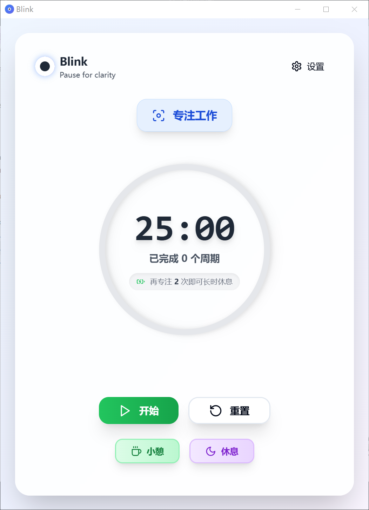
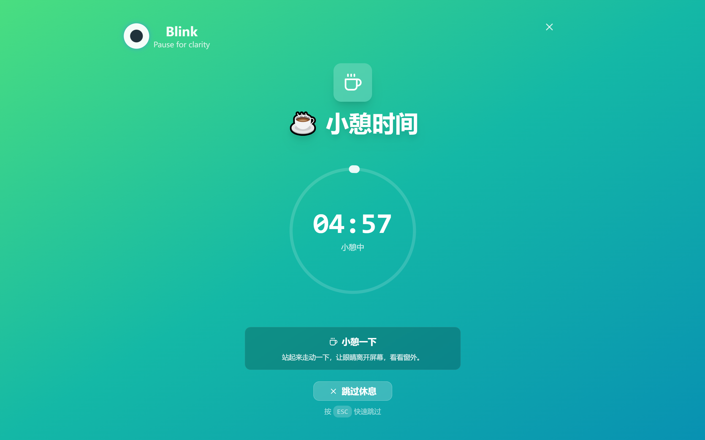
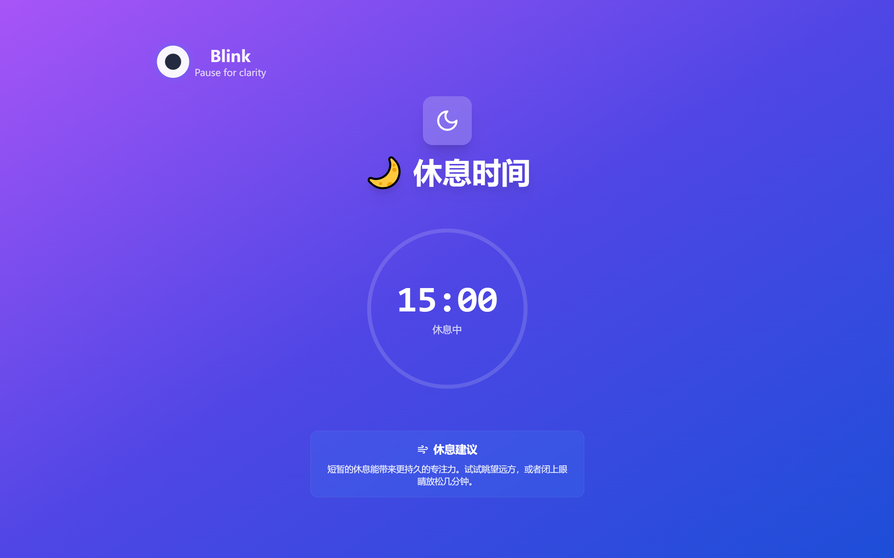

# 专注提醒助手 (Blink)

<div align="center">


**一个基于 Tauri + React 的现代化时间监控和强制休息提醒软件**

[](https://github.com/Mrzhuo2022/blink/releases)
[](https://opensource.org/licenses/MIT)
[](https://github.com/Mrzhuo2022/blink/issues)
[](https://github.com/Mrzhuo2022/blink/stargazers)

[下载](#-下载) • [功能特点](#-功能特点) • [使用说明](#-使用说明) • [开发](#-开发) • [贡献](#-贡献)

</div>

## 📸 屏幕截图

<div align="center">

<br/>
<em>主界面 - 简洁现代的计时器界面</em>
</div>

<div align="center">

<br/>
<em>全屏小憩界面</em>

<br/>
<em>全屏休息界面 - 强制休息保护眼睛健康</em>
</div>

## 🚀 下载

### 最新版本

从 [Releases](https://github.com/Mrzhuo2022/blink/releases) 页面下载适合你操作系统的版本：

- **Windows**: `Blink_x.x.x_x64_en-US.msi`
- **macOS**: `Blink_x.x.x_x64.dmg`
- **Linux**: `blink_x.x.x_amd64.AppImage`

### 通过包管理器安装

```bash
# 即将支持
# winget install YourName.Blink
# brew install --cask blink
# sudo apt install blink
```

## ✨ 功能特点

<table>
<tr>
<td>

### 🎯 智能护眼机制

采用"两次小憩后强制休息"的科学护眼模式

### 👁️ 强制休息保护

小憩可跳过，强制休息不可跳过，真正保护眼睛健康

### 🔄 智能休息周期

工作 → 小憩(可跳过) → 工作 → 小憩(可跳过) → 工作 → 强制休息(不可跳过)

</td>
<td>

### 🎨 多种色彩主题

护眼色彩预设，缓解视觉疲劳

### 🔔 原生通知系统

使用系统级通知，无需浏览器权限

### 🖥️ 全屏休息界面

休息时占满全屏并置顶，确保用户真正休息

</td>
</tr>
<tr>
<td>

### 🎨 现代化 UI

使用 Tailwind CSS 和现代设计语言

### ⚡ 高性能

基于 Tauri 框架，资源占用极低

</td>
<td>

### 🌙 深色模式

自适应系统主题

### 🔧 高度可定制

可自定义工作时间、休息时间和护眼周期

</td>
</tr>
</table>

## 🛠️ 技术栈

<div align="center">

| 前端         | 后端      | 工具           |
| ------------ | --------- | -------------- |
| React 18     | Tauri 2.0 | Vite           |
| TypeScript   | Rust      | ESLint         |
| Tailwind CSS | 原生通知  | Prettier       |
| Zustand      | 系统集成  | GitHub Actions |
| Lucide React | 跨平台    | pnpm           |

</div>

### 前端技术

- **React 18** - 现代化的用户界面框架
- **TypeScript** - 类型安全的 JavaScript
- **Vite** - 快速的构建工具
- **Tailwind CSS** - 现代化的 CSS 框架
- **Zustand** - 轻量级状态管理
- **Lucide React** - 美观的图标库

### 后端技术

- **Tauri 2.0** - 跨平台桌面应用框架
- **Rust** - 高性能系统编程语言
- **原生通知** - 系统级通知服务

## 🏗️ 开发

### 环境要求

- **Node.js** >= 18.0.0
- **Rust** >= 1.70.0
- **pnpm** 推荐包管理器

### 快速开始

```bash
# 克隆项目
git clone https://github.com/Mrzhuo2022/blink.git
cd blink

# 安装依赖
pnpm install

# 开发模式运行
pnpm run tauri:dev

# 构建生产版本
pnpm run tauri:build
```

### 开发脚本

```bash
# 前端开发
pnpm run dev              # 启动 Vite 开发服务器
pnpm run build            # 构建前端

# Tauri 开发
pnpm run tauri:dev        # 启动 Tauri 开发模式
pnpm run tauri:build      # 构建 Tauri 应用

# 代码质量
pnpm run lint             # ESLint 检查
pnpm run format           # Prettier 格式化
pnpm run type-check       # TypeScript 类型检查
pnpm run check            # 运行所有检查
pnpm run fix              # 自动修复代码问题
```

### 项目结构

```
.
├── src/                    # 前端源码
│   ├── components/         # React 组件
│   │   ├── ui/            # UI 基础组件
│   │   ├── TimerDisplay.tsx  # 主计时器组件
│   │   └── FullScreenBreak.tsx  # 全屏休息组件
│   ├── hooks/             # React Hooks
│   │   └── useTimer.ts    # 计时器逻辑
│   ├── services/          # 服务层
│   │   ├── notification.ts # 通知服务
│   │   └── window.ts      # 窗口控制服务
│   ├── store/             # 状态管理
│   │   └── timer.ts       # 计时器状态
│   ├── lib/               # 工具函数
│   └── main.tsx           # 应用入口
├── src-tauri/             # Tauri 后端
│   ├── src/
│   │   ├── main.rs        # 入口文件
│   │   └── lib.rs         # 主要逻辑（包含窗口控制命令）
│   ├── build.rs           # 构建脚本
│   ├── Cargo.toml         # Rust 依赖配置
│   └── tauri.conf.json    # Tauri 配置
└── package.json           # 前端依赖配置
```

### 自定义配置

<details>
<summary>点击展开详细配置说明</summary>

#### 时间设置

在 `src/store/timer.ts` 中修改默认时间：

```typescript
const defaultSettings = {
  workDuration: 25, // 工作时间（分钟）
  shortBreakDuration: 5, // 小憩时间（分钟）
  longBreakDuration: 15, // 强制休息时间（分钟）
  workSessionsUntilLongBreak: 2, // 护眼周期
};
```

#### 通知自定义

在 `src/services/notification.ts` 中自定义通知内容

#### 界面样式

在 `src/components/FullScreenBreak.tsx` 中调整全屏休息界面样式

#### 应用配置

在 `src-tauri/tauri.conf.json` 中配置：

- 窗口大小和属性
- 应用图标和标识符
- 插件设置
- 安全策略

</details>

## 💡 使用说明

### 🔄 核心护眼功能

**智能护眼周期**：

1. **工作阶段** - 专注工作（默认25分钟）
2. **小憩阶段** - 5分钟短暂休息（可跳过）
3. **工作阶段** - 继续专注工作
4. **小憩阶段** - 再次5分钟短暂休息（可跳过）
5. **工作阶段** - 继续专注工作
6. **强制休息** - 15分钟强制休息（不可跳过），保护眼睛健康

**设计理念**：

- ✅ 小憩可以跳过，适应紧急工作需求
- ❌ 强制休息不可跳过，确保眼睛得到充分保护
- ⚙️ 默认2次小憩后强制长休息，可在设置中调整

### 🎮 基本功能

| 功能      | 描述                       | 快捷键   |
| --------- | -------------------------- | -------- |
| 开始工作  | 点击开始按钮启动计时       | `Space`  |
| 暂停/继续 | 随时暂停或继续工作计时     | `Space`  |
| 小憩模式  | 5分钟短暂休息（可跳过）    | `Ctrl+B` |
| 休息模式  | 15分钟强制休息（不可跳过） | `Ctrl+R` |
| 设置      | 打开设置界面               | `Ctrl+,` |

### 🎨 主题选择

应用提供6种护眼色彩主题：

<div align="center">

| 主题        | 特点     | 推荐场景    |
| ----------- | -------- | ----------- |
| 🌟 默认主题 | 清新活力 | 日常使用    |
| 🔥 温暖主题 | 暖色调   | 温馨氛围    |
| 🧊 冷静主题 | 低饱和度 | 护眼舒适 ⭐ |
| 🌱 自然主题 | 绿色系   | 缓解疲劳 ⭐ |
| 🌅 日落主题 | 暖橙色调 | 舒缓放松    |
| 🌊 海洋主题 | 蓝色系   | 宁静深邃    |

</div>

## 📦 构建和分发

### 自动构建

项目配置了 GitHub Actions 自动构建流程：

1. **推送标签触发构建**：

   ```bash
   git tag v1.0.0
   git push origin v1.0.0
   ```

2. **自动构建多平台**：
   - Windows: `.msi` 安装包
   - macOS: `.dmg` 镜像文件
   - Linux: `.AppImage` 可执行文件

3. **自动发布到 Releases**：
   - 创建草稿 Release
   - 上传构建产物
   - 手动编辑发布说明

### 手动构建

```bash
# Windows
pnpm run tauri:build
# 生成位置: src-tauri/target/release/bundle/

# macOS (需要开发环境和签名证书)
pnpm run tauri:build

# Linux (支持多种格式)
pnpm run tauri:build
```

## 💡 使用技巧

### 护眼建议 👁️

- 🔄 推荐保持默认的2次小憩后强制休息设置
- ⏰ 强制休息时请完整休息15分钟，不要强制退出
- 👁️ 小憩时可以简单闭目养神，强制休息时建议起身活动

### 工作效率 🚀

- ⏭️ 小憩模式可以跳过，适应紧急工作需求
- 🛡️ 强制休息是为了保护眼睛，请配合执行
- ⚙️ 可以根据个人习惯调整工作时间和休息时间

### 健康提醒 🏥

- 📊 界面会显示当前护眼进度（已完成几次小憩）
- ⚠️ 接近强制休息时会有明显提醒
- 🔒 强制休息时界面会明确标注"不可跳过"

## 🤝 贡献

我们欢迎所有形式的贡献！

### 如何贡献

1. **Fork 本项目**
2. **创建功能分支** (`git checkout -b feature/AmazingFeature`)
3. **提交更改** (`git commit -m 'Add some AmazingFeature'`)
4. **推送到分支** (`git push origin feature/AmazingFeature`)
5. **创建 Pull Request**

### 贡献类型

- 🐛 **Bug 修复**
- ✨ **新功能**
- 📚 **文档改进**
- 🎨 **界面优化**
- 🔧 **性能优化**
- 🌍 **国际化**

### 开发指南

- 遵循现有的代码风格
- 添加必要的测试
- 更新相关文档
- 确保 CI 检查通过

<details>
<summary>查看详细的贡献指南</summary>

#### 代码规范

- 使用 ESLint 和 Prettier 保持代码风格一致
- 提交前运行 `pnpm run check` 检查代码质量
- 使用语义化的 Git 提交消息

#### 测试

- 为新功能添加测试
- 确保现有测试通过
- 测试覆盖率保持在合理水平

#### 文档

- 更新 README.md（如果需要）
- 添加必要的代码注释
- 更新 CHANGELOG.md

</details>

## 🐛 问题反馈

如果你遇到问题或有建议，请：

1. **查看 [Issues](https://github.com/Mrzhuo2022/blink/issues)** 是否有相似问题
2. **创建新 Issue** 并提供详细信息：
   - 操作系统版本
   - 应用版本
   - 重现步骤
   - 错误日志（如果有）

## 📄 许可证

本项目采用 MIT 许可证。详情请参阅 [LICENSE](LICENSE) 文件。

## 🙏 致谢

感谢以下优秀的开源项目：

- [Tauri](https://tauri.app/) - 跨平台应用框架
- [React](https://reactjs.org/) - 用户界面库
- [Tailwind CSS](https://tailwindcss.com/) - CSS 框架
- [Lucide](https://lucide.dev/) - 图标库
- [Zustand](https://github.com/pmndrs/zustand) - 状态管理

## 📊 统计信息


---

<div align="center">

**如果这个项目对你有帮助，请给我们一个 ⭐️**

Made with ❤️ by [Mrzhuo2022](https://github.com/Mrzhuo2022)

</div>
